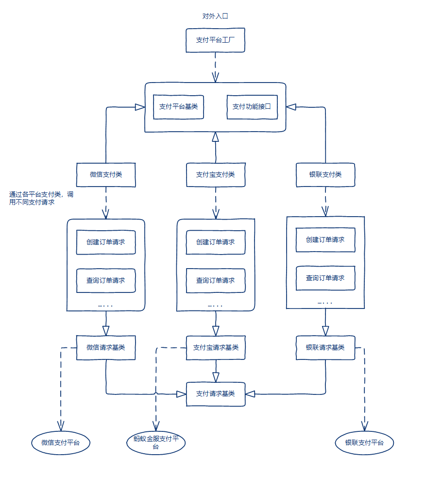

## 一些说明

> 对接微信、支付宝、银联支付平台的统一调用类库

> 目前仅实现微信App和扫码支付

 

****

## 入坑

## &sect; 微信

#### 1、官方文档

 * [微信支付开发文档](https://pay.weixin.qq.com/wiki/doc/api/index.html)
 * [各支付方式接入指引](http://kf.qq.com/faq/170830jimmaa170830B7F7NJ.html)
 * [微信开放平台APICloud](https://docs.apicloud.com/Others/Open-SDK-Integration-Guide/weChat)

#### 2、要点说明

 * 商户账号

    1、所有支付操作均需通过微信商户平台账号进行，而商户账号是无法直接注册的，需在【微信公众平台】或【微信开放平台】对应账号中开通支付权限后获得

    2、扫码支付/公众号支付，需在【微信公众平台】账号开通支付权限，对应会分配1个商户平台账号

    3、App支付，需在【微信开放平台】账号开通支付权限，对应也会分配1个商户平台账号

    4、而这2个商户账号，咨询官方客服得知，（目前）是无法关联的。所以在申请开通支付权限时，2个账号的商户经营信息和资金银行卡请保持一致

    * [商户补充材料说明](http://kf.qq.com/faq/170807nY7Jbi170807Yf6jIB.html)

 * 沙箱环境

    1、正式上线前，需通过沙箱环境的验收用例测试，关注官方微信号“WXPayAssist”可获取验收用例

    2、必选用例全部测试通过后，提交给微信审核，审核通过后才会开通正式支付权限（然而似乎并不需要？）

    * [支付验收指引](https://pay.weixin.qq.com/wiki/doc/api/jsapi.php?chapter=23_1)

 * 签名
    
    1、所有支付接口请求均需要传入签名（sign）参数，该参数值是通过当前参数列表的值+商户API密钥计算得到

    2、正式环境下，签名所用到的API密钥在商户账号获取
    
    3、沙箱环境下，API密钥则通过getsignkey接口获取（详见上面的支付验收指引链接）

    4、注意，getsignkey接口的参数也是需要签名的，而该签名用到的仍是正式环境的API密钥，也仅有该接口如此

    * [签名算法](https://pay.weixin.qq.com/wiki/doc/api/jsapi.php?chapter=4_3)
    * [签名校验工具](https://pay.weixin.qq.com/wiki/tools/signverify/)

  * 扫码支付

    1、微信提供2种支付模式，模式1返回的支付链接是长链接，建议调用官方接口转成短连接，而模式2返回的就是短链接格式

    * [转换短连接](https://pay.weixin.qq.com/wiki/doc/api/native.php?chapter=9_9&index=10)

  * App支付

    1、注意官方文档中，App支付的API列表会多出一个“调起支付接口”。该接口是App端调用微信SDK唤起支付功能的接口

    2、该接口用到的7个（固定）参数均由后端返回

    3、注意该接口的签名值，是由其它6个参数按签名算法计算得到。其中“prepayid”和“noncestr”2个参数值，是来源于“统一下单”接口的返回值

    * [调起支付接口](https://pay.weixin.qq.com/wiki/doc/api/app/app.php?chapter=9_12&index=2)

#### 3、参考资料

 * [微信支付 一步一个坑的APP支付！](https://segmentfault.com/a/1190000006886519)

****

## &sect; 支付宝

#### 1、官方文档

 * [蚂蚁金服开发文档](https://openhome.alipay.com/developmentDocument.htm)

#### 2、要点说明

#### 3、参考资料

****

## &sect; 银联

#### 1、官方文档

#### 2、要点说明

#### 3、参考资料
